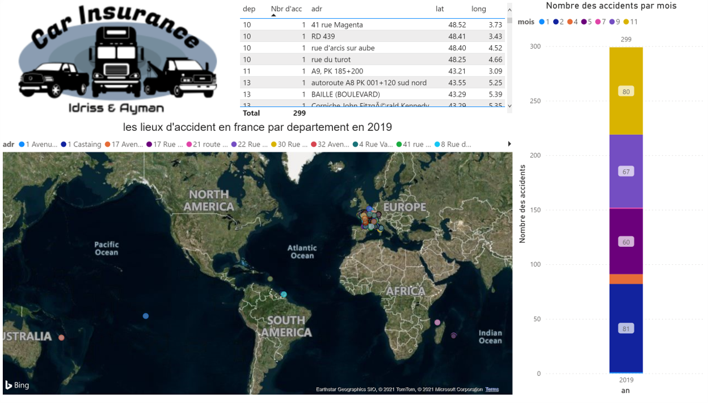
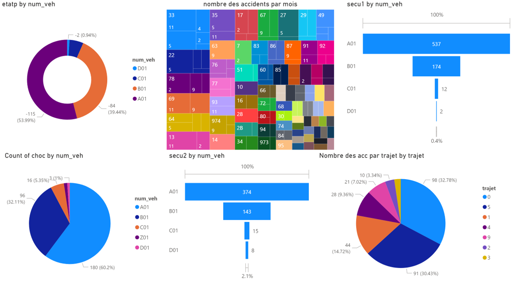

# Projet_BI_Creation_tableau_de_bord
Creation d'un tableau de bord avec Power BI - La Gestion des Accidents en France 2019

## ProjetBI.pbix : Le Ficher du Power BI

# First Page -> Zoomer la Carte du France et selectionner un Couleur pour la Description 

# Seconde Page

# Logo

